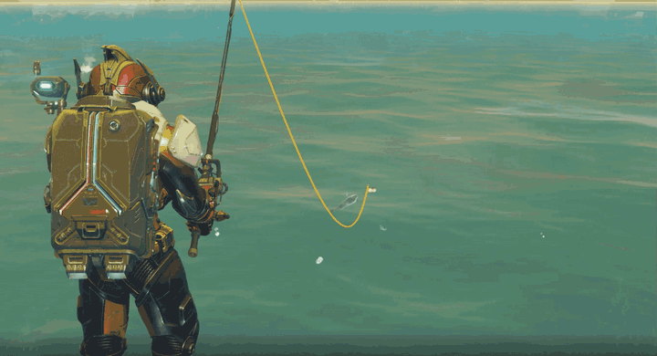
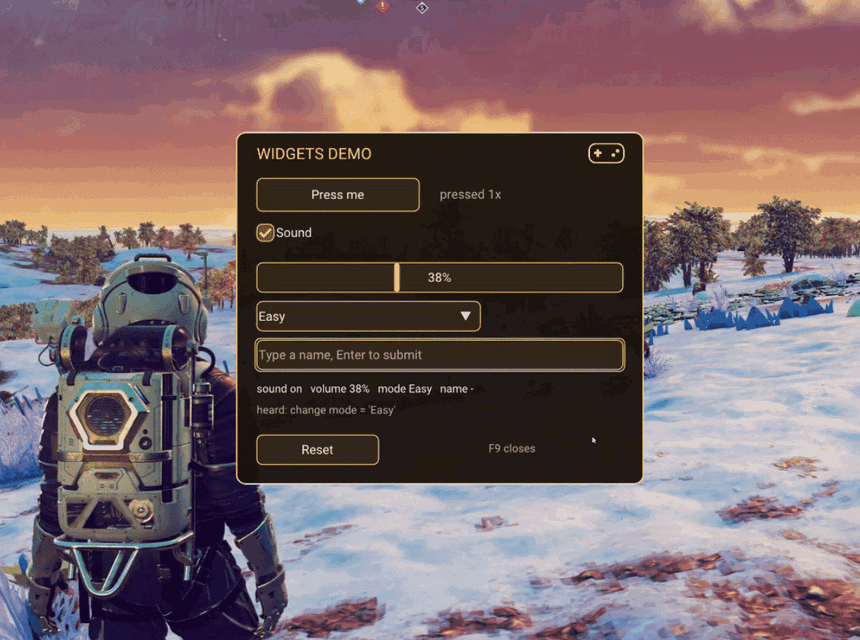

# OreoRuntime

<p>
  
  
</p>

OreoRuntime is a tool that helps you make clickable interfaces for Python mods inside No Man's Sky. Controllers are supported.

1. Download the release zip from GitHub and unpack it. Inside is `project_oreo_runtime-0.1.6-py3-none-win_amd64.whl`.
2. Find the Python that has pyMHF installed.
3. Open a command prompt in the folder with the wheel.
4. Run:

    ```
    "<path to python.exe from step 2>" -m pip install --no-index --no-deps --upgrade project_oreo_runtime-0.1.6-py3-none-win_amd64.whl
    ```

5. Wait for the line `Successfully installed project-oreo-runtime-0.1.6`.
6. Start the game with a mod that uses the runtime (or with the example mod from the examples/widgets_demo folder). The runtime starts by itself when the mod calls `oreo_runtime.start(...)`.

Known issues:

Visual bugs when using HDR

Example mods:

1. examples/widgets_demo
2. https://github.com/Carbonster/FishingMinigameMod

Uninstalling the runtime

1. Find the Python that has the runtime installed.
2. Run:

    ```
    "<path to python.exe>" -m pip uninstall -y project-oreo-runtime
    ```

3. Delete the `<this Python's folder>\Lib\site-packages\oreo_runtime` folder if it is still there. pip does not remove the gamepad helper's logs (`logs\controller.log`), so the folder is usually left behind.
4. Optional: delete `%APPDATA%\ProjectOreo\overlay.ini`. It is the setting for the overlay's debug panel.
